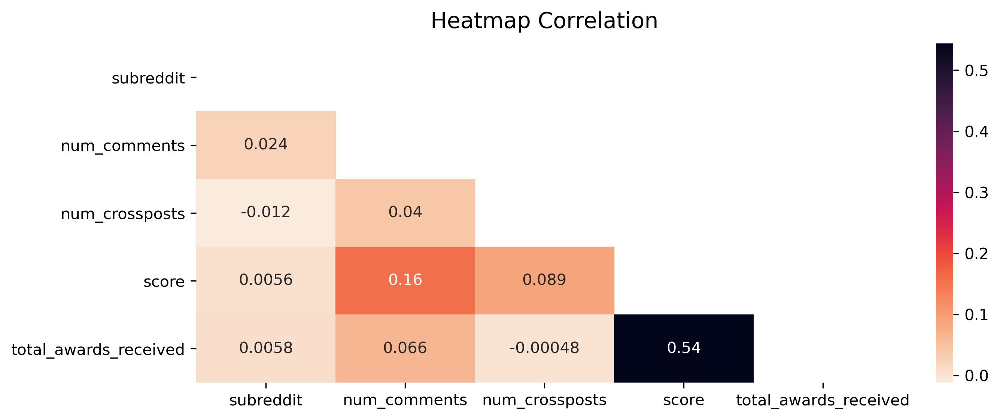
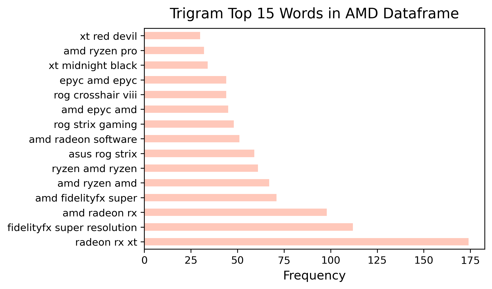
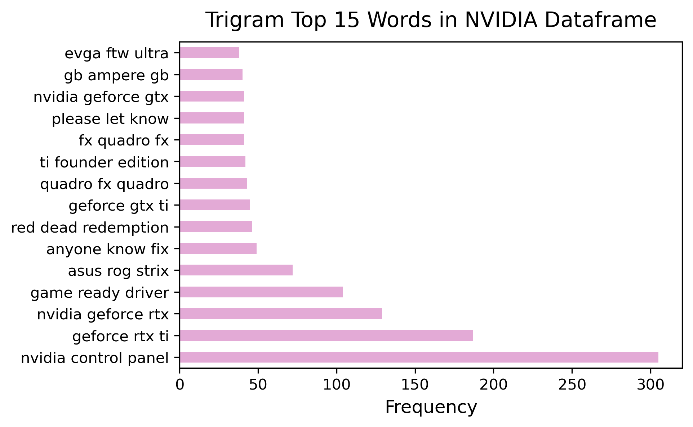

#  Project 3: Web APIs & NLP

## Executive Summary

When building a gaming PC, one of the most important components is the graphics card. What happens when you face an issue with your graphics card and need some technical help from the PC building company that you bought your gaming PC from, only to realise that it is after office hours? You could drop an email, but you wouldn't get a reply till the next working day earliest. You could scour through the internet looking for an answer, but that's assuming you know exactly what is wrong and where to look. This project aims to build a classifier that will accurately predict which subreddit your question regarding the graphics card bought from Good Games for Everyone (GGE) falls into (either r/AMD or r/NVIDIA since we only carry these 2 brands). Eventually, the project may expand to returning a link containing the solution to your issue based on the keywords picked up. But for now, we will focus on creating as accurate a r/AMD and r/NVIDIA classifier as possible. 

We train multiple classifier models (Logistic Regression, Multinomial Naive Bayes and Decision Tree) with data scrapped and cleaned from the 2 subreddits, totalling 20 000 posts. The models undergo GridSearchCV to optimise the hyperparameters and return the best possible classification predictions. The models are then evaluated based on the Accuracy score, the Area Under Curve (AUC) value, and the Sensitivity and Specificity score. The model with the best balance and high scores throughout is then selected. 

The TfidfVectorizer Logistic Regression was selected in this project, having a 87% accuracy in overall correct predictions, an AUC score indicating that data has 95% probability of being classified correctly, Sensitivity score showing that 86% of all r/AMD posts were correctly classifed and Specificty score showing 88% of all r/NVIDIA posts were correctly classified.
The process was analysed and we found ways to improve on the model. Given more time, we believe we would have been able to improve the models even further.

## Problem Statement

Company Management has tasked the Data Science Division and Software Engineering team to find a way to field after-hours requests for technical help regarding graphic cards (namely, AMD and NVIDIA). 
**This project aims to build a classifier which identifies keywords to accurately predict whether a question belongs to the AMD subreddit or NVIDIA subreddit.**

## Background

Good Games for Everyone (GGE) is a PC building company which specialises in constructing high-performance gaming terminals for our customers.

Based on Customer Service Requests analysis, it was found that the majority of the company's customer service requests were regarding graphic cards. These requests mainly consists of 2 categories:
- gaming terminal graphics cards special order requests
- technical help on graphics cards

While there are enough Customer Support Officers to hande the customer requests for technical help on graphics cards during office hours, there are also plenty of such requests after office hours which goes unanswered and piles up to the next working day.

The Company Management has therefore tasked us, the Data Science Division, to work with the Software Engineering team to find a way to field the after office hours graphics cards requests in order to achieve higher level of customer care.

The Software Engineering team wants to create a chatbox which receives a question from customers and returns a relevant subreddit link containing potential solutions to the customers. They intend to resolve this with a Two-Phase approach:
1. correctly classify the questions into the subreddit it belongs to (**First Phase**)
2. then returns a relevant subreddit link containing potential solutions to the customers (**Second Phase**).

**The focus of this project will only be on the First Phase. In other words:**

The role of the Data Science Division in this project currently is to help with classifying the questions received into the correct subreddit, which is either the AMD or the NVIDIA subreddits since GGE only carries these 2 brands. 

## Data Dictionary

|Feature|Type|Dataset|Description|
|---|---|---|---|
|**subreddit**|*integer*|all datasets|The subreddit that each post originated from (AMD = 1, NVIDIA = 0)| 
|**num_comments**|*integer*|all datasets|The number of comments per post| 
|**num_crossposts**|*integer*|all datasets|The number of times the post was cross-posted to other subreddits| 
|**score**|*integer*|all datasets|The number of upvotes the posts received| 
|**total_awards_received**|*integer*|all datasets|The number of awards the post has received in total| 
|**title_selftext**|*string*|all datasets|The interaction term created, containing the post title concatenated with post description| 
|**cleaned_texts**|*string*|all datasets|The cleaned version of 'title_selftext' where links, punctuations and stopwords were removed and the text data was lemmatized to prepare for modelling| 

## Analysis Summary

The data used in the modelling is simple and used only the text data from the title + selftext column. This is because our EDA revealed that the other numerical datas that were thought to potentially have an impact on the classification turned out to have very little correlation with the target variable, the subreddits, and were therefore not used. 

EDA also showed that the graphic card model names for AMD and NVIDIA were important in helping with classfication as they appear frequently and are unique to their respective brands and subreddits. 

|Model|Train Accuracy|Test Accuracy|Sensitivity|Specificity|AUC|
|:---:|:---:|:---:|:---:|:---:|:---:|
|**Baseline**|-|0.500|-|-|-|
|||||||
|**CountVectorizer Logistic Regression**|0.867|0.880|0.895|0.866|0.955|
|||||||
|**TfidfVectorizer Logistic Regression**|0.870|0.876|0.860|0.883|0.955|
|||||||
|**CountVectorizer Multinomial Naive Bayes**|0.859|0.871|0.857|0.885|0.941|
|||||||
|**TfidfVectorizer Multinomial Naive Bayes**|0.856|0.862|0.823|0.902|0.946|
|||||||
|**CountVectorizer Decision Tree**|0.772|0.762|0.573|0.951|0.881|
|||||||
|**TfidfVectorizer Decision Tree**|0.764|0.760|0.564|0.958|0.869|

Above is a table showing a summary of the scores between all the different model combinations. The best model for accurately classifying the posts to their respective subreddits is the TfidfVectorizer Logistic Regression, after analysing and determined to have the most well rounded and high scores overall for Train and Test Accuracies, Area Under Curve, and Sensitivity & Specificity metrics.

## Conclusions/Recommendations

As mentioned in the problem statement/background, this basic classification will serve as the first phase and focuses on creating an accurate classifier by identifying keywords and predicting the subreddits. Second phase will see the classifier start to identify specific posts with solutions.

In order to continuously improve on our classifier and get it ready for the project's second phase, the following can be done:
- Test out with other different types of models
- Further tune the hyerparameters
- Software team to use Customer ID and Product ID to automatically pull out the brand and model of the customer's graphic card, since we found out from our EDA that brand and model is important in helping with classification
- Scrap additional solutions from other AMD and NVIDIA forums on top of reddit

Recommendations for the future of this project beyond the project second phase:
- Turn the classifier into a complete AI recommendation solution for all customers inquiries, not just limited to AMD and NVIDIA graphic cards